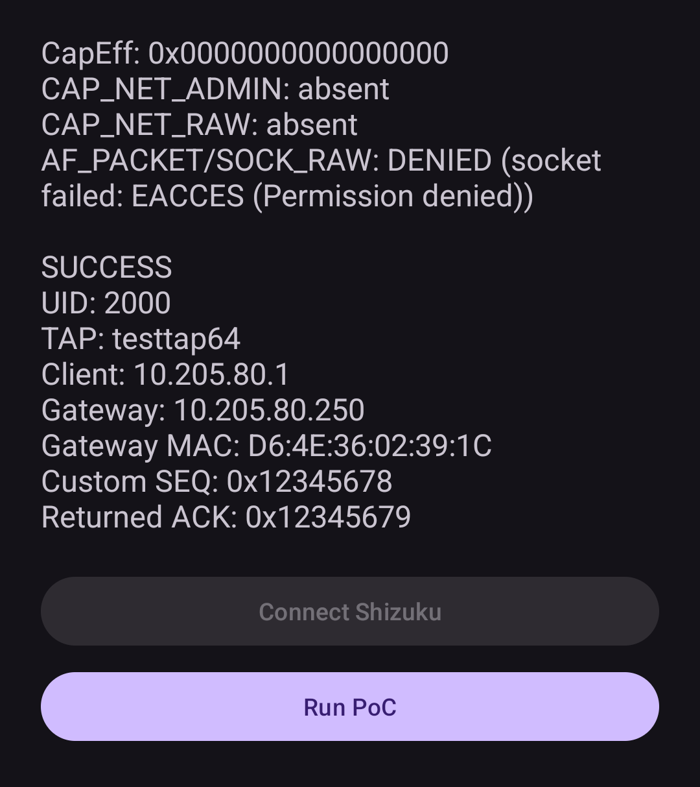

# From AOSP Test Harness to Real-World Egress: Repurposing Android Test TAPs with Ethernet Tethering and Shizuku

## Abstract

Android applications normally rely on sockets for transport-layer networking. Direct construction of IP and TCP headers is instead associated with lower-level facilities such as raw or packet sockets, which are unavailable to ordinary Android applications and normally require Linux networking privileges.

This writeup describes a different path built almost entirely from existing AOSP test infrastructure.

Android's connectivity tests can create userspace-accessible TAP interfaces and attach them as Ethernet tethering downstreams. Running under the ADB `shell` identity through Shizuku, the same mechanism can be repurposed while leaving Android's normal tethering upstream selection intact. Frames written to the TAP then enter the regular tethering forwarding and NAT datapath and can leave through the device's real Internet connection.

A minimal PoC runs with an empty effective Linux capability set and cannot open an `AF_PACKET/SOCK_RAW` socket. Nevertheless, it constructs a TCP SYN with sequence number `0x12345678` and receives an Internet SYN/ACK acknowledging `0x12345679`.

The result is not acquisition of `CAP_NET_RAW` or direct physical-interface injection. It is a framework-mediated packet-egress primitive that provides useful packet-level control without either.

---

## 1. What I Found

I wanted to send packets whose L3/L4 representation I controlled myself.

Normal TCP sockets do not allow that: the kernel owns TCP state and constructs the actual segments, including fields such as sequence numbers. Raw IP or `AF_PACKET` sockets would normally provide lower-level control, but they are not available to ordinary Android applications.

AOSP's connectivity tests already contain another route. Their Ethernet tethering tests can create a userspace TAP through `TestNetworkManager`, allow test interfaces in `EthernetManager`, and attach the TAP as a tethered Ethernet downstream. Much of the PoC setup is derived directly from this test code.

https://android.googlesource.com/platform//packages/modules/Connectivity/+/588a9d5b2658bbb4cb22f99a7cc87170b96599c8/Tethering/tests/integration/base/android/net/EthernetTetheringTestBase.java

Conceptually, AOSP uses the TAP as a synthetic client behind Android's tethering stack:

```text
synthetic client
      ↓
   test TAP
      ↓
Android Tethering
      ↓
 test upstream
      ↓
synthetic peer
```

The key observation is that the TAP does not have to remain part of a closed test environment. If no synthetic upstream is introduced, Android can use its normal Wi-Fi or cellular upstream:

```text
userspace packet generator
          ↓
       test TAP
          ↓
   Android Tethering
          ↓
 normal selected upstream
          ↓
   Wi-Fi / cellular
          ↓
       Internet
```

This turns the test TAP into a practical packet-egress interface. Userspace controls the packet before it enters tethering, while Android handles forwarding and NAT.

The individual mechanisms are not new; the interesting part is using the AOSP test downstream as an ingress into the device's real networking path.

---

## 2. Turning the Test TAP into an Internet Egress Path

The privileged part of the PoC runs as a Shizuku UserService under the Android `shell` UID, 2000.

The downstream setup closely follows AOSP's Ethernet tethering tests: a test TAP is created, test interfaces are enabled in EthernetManager, and the TAP is requested as a tethered Ethernet interface. 

```text
createTapInterface()
        ↓
setIncludeTestInterfaces(true)
        ↓
requestTetheredInterface()
        ↓
start TETHERING_ETHERNET
```

The TAP then represents a synthetic Ethernet client behind Android's tethering stack.

The PoC obtains an IPv4 configuration over DHCP, resolves the tethering gateway with ARP, constructs complete Ethernet/IPv4/TCP frames in userspace, and writes them to the TAP.

Android handles the rest: forwarding, NAT, upstream selection, and transmission through the device's real network connection.

This is routed packet injection rather than direct physical-interface injection. Userspace controls the packet before it enters the tethering datapath; Android may subsequently rewrite fields such as the source address, port, TTL, and checksums.

### A minimal example

The PoC manually builds a TCP SYN with a chosen sequence number:

```text
SEQ = 0x12345678
```

The complete Ethernet + IPv4 + TCP frame is written to the TAP and forwarded by Android through its normal tethering path.

A remote TCP peer receiving the SYN must acknowledge:

```text
ACK = SEQ + 1
```

The PoC receives:

```text
Returned ACK = 0x12345679
```

This provides a simple end-to-end proof that the handcrafted TCP header reached an Internet peer and influenced its response.

---

## 3. No Raw Socket, Still Packet-Level Egress

The most interesting security-model property of this approach is what the process **does not** have.



**Figure 1:** PoC output showing empty `CapEff`, denied `AF_PACKET/SOCK_RAW`, and successful `SEQ -> ACK` Internet round trip.

This result means that Shizuku does not grant `CAP_NET_RAW`. The process has no effective Linux capabilities, and a direct `AF_PACKET/SOCK_RAW` attempt fails with `EACCES`. The Android framework provides a separate, delegated path: privileged services create and configure the tethered test TAP, while userspace only reads and writes frames through its file descriptor.

In other words:

> **No `CAP_NET_RAW`, no raw socket - yet packet-level Internet egress.**

The same underlying mechanism is used in an Android zapret2 client and has been observed working across devices from Google, Samsung, Vivo, Xiaomi/Redmi, Huawei, Lenovo, Infinix, and Tecno. These observations come from real-world use of the client rather than a controlled per-device validation of the minimal PoC.

---

## 4. Prior Art and What Is Actually New

The closest prior art is AOSP itself. Its Ethernet tethering tests already create test TAP interfaces, attach them as tethered Ethernet downstreams, emulate clients, and inject packets through the resulting test topology. Much of the PoC setup is derived directly from this code.

AOSP forwarding tests usually complete the topology with a synthetic upstream so forwarded packets can be observed in a controlled environment. This work leaves upstream selection untouched, allowing the same downstream TAP to feed Android's real Wi-Fi or cellular path.

A closely related project is Shizzi, which also combines Shizuku, `TestNetworkManager`, and tethering without root. Its topology is effectively reversed: Shizzi uses a test TUN as the tethering upstream and processes traffic from ordinary hotspot clients in userspace.

```text
Shizzi:

hotspot client
     ↓
 tethering
     ↓
 test TUN
     ↓
 userspace
```
```text
This work:

userspace packet generator
       ↓
test TAP downstream
       ↓
   tethering
       ↓
 real upstream
```

I have not found public prior work explicitly using the AOSP test Ethernet downstream as a general packet-crafting path to the real Internet. That remains a best-effort prior-art assessment rather than a claim of absolute novelty.

---

## 5. Security Meaning and Limitations

This is not an application sandbox escape. The privileged component runs as the ADB `shell` identity through Shizuku, so the user has already authorized access to a powerful Android principal.

What is interesting is the mismatch between Linux capabilities and framework-reachable effects. The process has neither `CAP_NET_RAW` nor `CAP_NET_ADMIN`, and cannot open an `AF_PACKET/SOCK_RAW` socket, yet Android services still let it send handcrafted packets through the normal forwarding path.

There are several limitations.

First, Android tethering remains in the middle. This is routed/NATed packet egress, not transparent physical-interface injection.

Second, the current minimal demonstration is IPv4/TCP. The architecture is not conceptually limited to that exact packet type, but claims about IPv6, fragmentation, unusual IP options, arbitrary protocol numbers or malformed packets should be based on separate testing rather than assumed from the SYN result.

Third, cross-device experience is broad but not exhaustive. A dozen of working devices do not establish universal compatibility with every Android version, OEM modification or custom ROM.

Finally, this writeup deliberately separates the mechanism from any particular higher-level application. The technique originated in practical work on a zapret2 client, but censorship circumvention is only one use case. The underlying primitive is simply a userspace-controlled Ethernet client connected to Android's real tethering datapath.

That is the main result:

**Linux still denies the process conventional raw-socket access, yet Android's framework exposes a separate path to packet-level egress. A shell process with no effective capabilities can inject handcrafted L2/L3/L4 traffic into the tethering datapath and have Android route and NAT it through a real upstream. The technique is narrower and more fragile than a true raw-networking capability: it depends on OEM framework behavior, hidden APIs, and the reliability of ADB-backed Shizuku access, while Android's normal tethering semantics remain in the path.**
